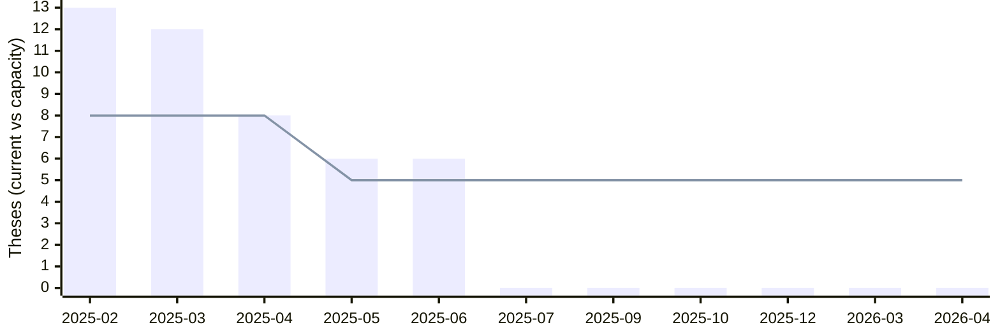

{: .text-center}

```mermaid
---
config:
    xyChart:
        width: 900
        height: 300
---
xychart-beta
    x-axis [2025-02, 2025-03, 2025-04, 2025-05, 2025-06, 2025-07, 2025-09, 2025-10, 2025-12, 2026-03, 2026-04]
    y-axis "Theses (current vs capacity)" 0 --> 13
    bar [13, 12, 8, 6, 6, 0, 0, 0, 0, 0, 0]
    line [8, 8, 8, 5, 5, 5, 5, 5, 5, 5, 5]
```